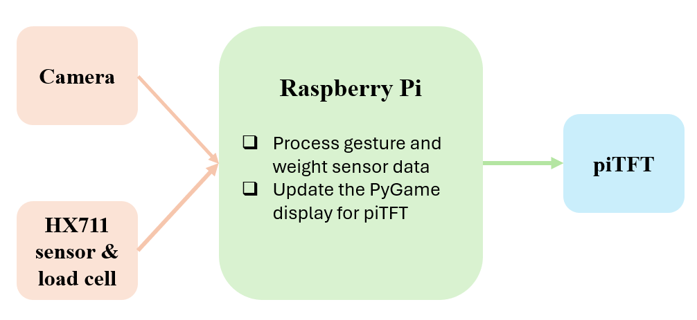
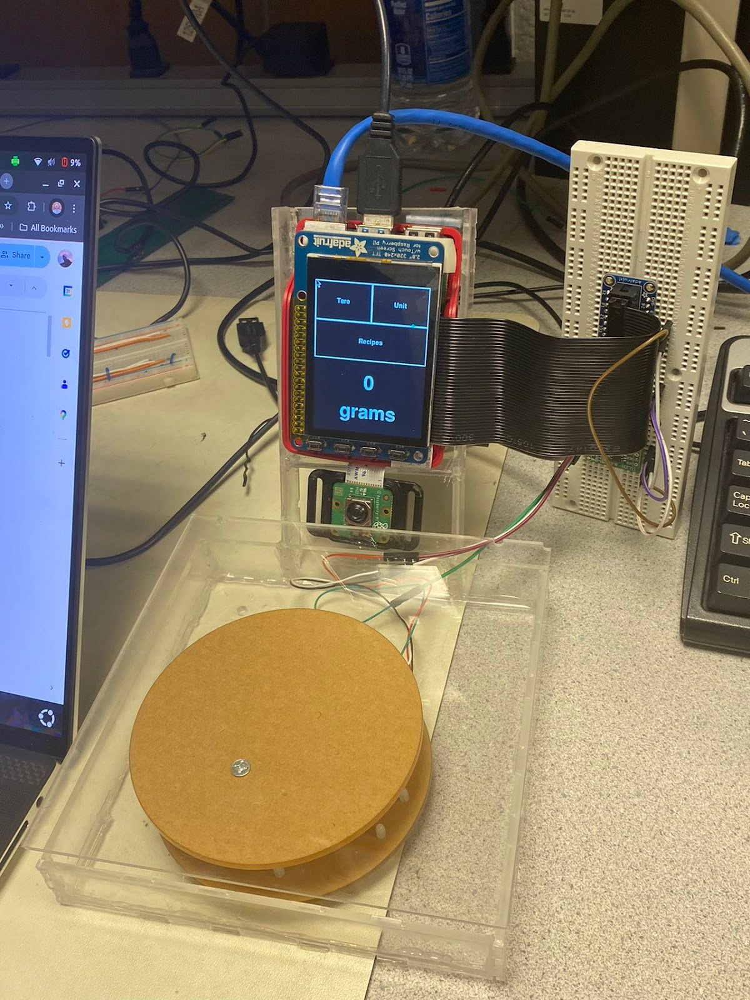
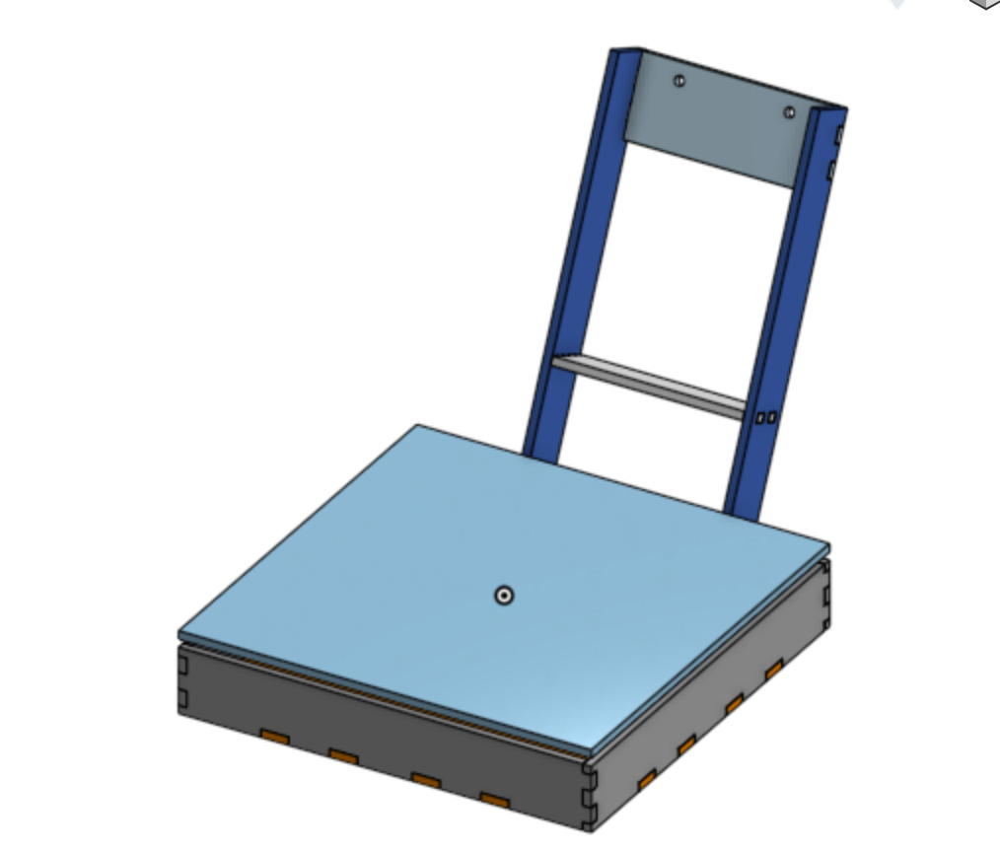
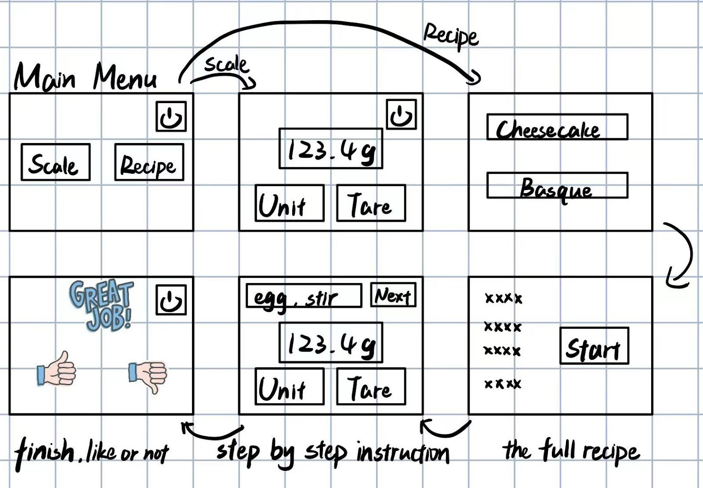
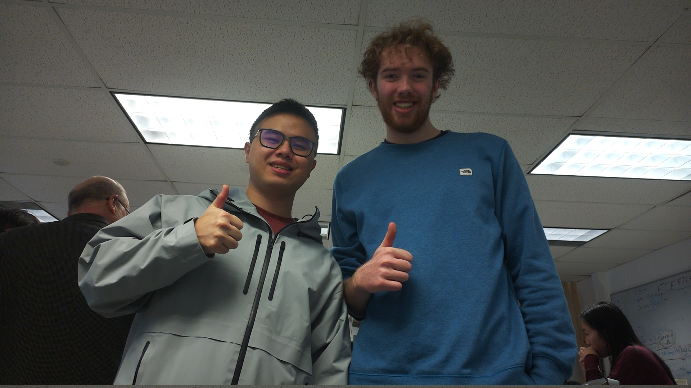

# ProScale - A Smart, Gesture Controlled, Contact Free Kitchen Scale

*By Michael Crum (mmc323@cornell.edu) and Zehui Lin (zl883)*

<iframe width="560" height="315" src="https://www.youtube.com/embed/et91Gea6CPk?si=lng-3xK4TcgsFHiM" title="YouTube video player" frameborder="0" allow="accelerometer; autoplay; clipboard-write; encrypted-media; gyroscope; picture-in-picture; web-share" referrerpolicy="strict-origin-when-cross-origin" allowfullscreen></iframe>

## Objective

For our final project we developed a kitchen scale with gesture-based controls using a Raspberry Pi, a load cell with an HX711 sensor, and a Pi TFT display. 
Motivated by the challenges of maintaining hygiene in the kitchen, we set out to create a hands-free solution that also enhances accessibility for individuals with limited mobility.
Users can easily weigh ingredients, switch units, and navigate recipes through a gesture-based interface on the Pi TFT screen, enhancing the kitchen prep experience.

## Introduction

This project integrates hardware and software to build a gesture-controlled kitchen scale.
At its core, the system utilizes a Raspberry Pi for processing, with a Pi Camera for real-time video capture, a load cell with HX711 sensor for weight measurements, and a Pi TFT display serving as the user interface, all housed in a custom laser-cut case.
The captured video is pre-processed using OpenCV for frame flipping, color conversion, and scaling, followed by MediaPipe for detecting 21 hand landmarks.
By analyzing the positions and distances of these landmarks, gestures like pinching and pointing are identified and mapped to actions like navigating recipes, switching units, and the tare function.
The interface, developed using PyGame, dynamically updates in response to cursor movement and click events, providing a touch-free, hygienic, and accessible user experience.

## High-Level System Design



> Figure 1: High-Level System Design

## Hardware Setup




> Figure 2: Final Hardware vs CAD

The functional components of our system are the Raspberry Pi, the PiTFT, the Pi Camera, and the load cell.
To connect these elements into a convenient package, we designed and laser cut an enclosure for the components.


## OpenCV and MediaPipe Implementation


> Figure 3: Hand Landmarks

MediaPipe is a collection of tools for applying machine learning models to various computer vision tasks.
For ProScale we used MediaPipe's hand landmarks model.
This model identifies hands within an input image and extracts the location of each joint.
See Figure 3 for a diagram of the information generated by MediaPipe.
Each landmark has a corresponding x and y location in screen space, as well as an estimate of z - the depth of the landmark.

We used a Pi Camera module to capture images for MediaPipe.
This was an easy choice because Pi Camera is widely used and very well documented.
We installed the picamera python driver using `sudo apt install -y python3-picamera2`. 
We then ran a simple test program to open a preview window:

```python
from picamera2 import Picamera2, Preview
import time
picam2 = Picamera2()
camera_config = picam2.create_still_configuration(main={"size": (1920, 1080)}, lores={"size": (640, 480)}, display="lores")
picam2.configure(camera_config)
picam2.start_preview(Preview.QTGL)
picam2.start()
time.sleep(60)
```

This example requires an X server connection and the `QTGL` driver to be available.
This is only the case when running the graphical desktop through the RPi’s HDMI port, and doesn’t work over an SSH connection.
To run the example over SSH, it is possible to forward the local X server using `ssh -x`, although the QTGL driver won’t be available. Instead, you’ll need to switch `Preview.QTGL` to `Preview.QT`.

Once the camera's functionality was confirmed, we looked for a way to display the camera’s output on the TFT’s screen. QT provides a frame buffer driver, but we were unable to make it function in our testing. Instead, we chose to write directly to the TFT’s frame buffer. This can be achieved as shown in the following snippet:

```python
frame = picam2.capture_array("lores")
image = cv2.cvtColor(frame, cv2.COLOR_YUV420p2BGR)
image = cv2.resize(image, (320, 240))

image = cv2.cvtColor(image, cv2.COLOR_BGR2BGR565)
with open("/dev/fb0", "rb+") as buf:
    buf.write(image)

```

With the picam up and running, we installed MediaPipe using `sudo pip install mediapipe` (`sudo` for compatibility with PyGame, which requires root to display on the TFT).
We were able to display an annotated diagram from the hand recognition model using the following snippet:

```python
with mp_hands.Hands(static_image_mode=False, min_detection_confidence=0.8, min_tracking_confidence=0.8, max_num_hands=1) as hands:
    while True:
        frame = picam2.capture_array("lores")
        image = cv2.cvtColor(frame, cv2.COLOR_YUV420p2BGR)
        detected_image = hands.process(image)
        image = cv2.resize(image, (320, 240))

        if detected_image.multi_hand_landmarks:
            for hand_lms in detected_image.multi_hand_landmarks:
                mp_drawing.draw_landmarks(
                    image,
                    hand_lms,
                    mp_hands.HAND_CONNECTIONS,
                    landmark_drawing_spec=mp.solutions.drawing_utils.DrawingSpec(
                        color=(255, 0, 255), thickness=4, circle_radius=2
                    ),
                    connection_drawing_spec=mp.solutions.drawing_utils.DrawingSpec(
                        color=(20, 180, 90), thickness=2, circle_radius=2
                    ),
                )

        image = cv2.cvtColor(image, cv2.COLOR_BGR2BGR565)
        with open("/dev/fb0", "rb+") as buf:
            buf.write(image)

        if cv2.waitKey(1) & 0xFF == ord("q"):
            break
```

The hand landmarks include information about the location of each joint in the detected hand.
We extract the tip of the thumb `hand_lms[4]` and used that as the cursor position for interaction.
We then extract the tip of the pointer finger `hand_lms[8]` and compare the location of the thumb and pointer finger the determine when the user is clicking. If the distance between the thumb and pointer finger is < 0.1, a click is registered and the relevant callback is executed. In code, this looks like:

```python
thumb_landmark = hand_lms.landmark[4]
pointer_landmark = hand_lms.landmark[8]

self.cursor_render_callback(1-thumb_landmark.x, 1-thumb_landmark.y)

if (thumb_landmark.x - pointer_landmark.x) ** 2 + (
    thumb_landmark.y - pointer_landmark.y
) ** 2 < 0.01 and self.click_callback:
    if self.clicking == False:
        self.click_callback(1-thumb_landmark.x, 1-thumb_landmark.y)
    self.clicking = True
else:
    self.clicking = False
```

## Weight Measurement
The weight measurement module combines the HX711 sensor, the 5kg load cell, and the Raspberry Pi to obtain weight readings.
The hardware configuration began with connecting the HX711's data (DT) and clock (SCK) pins to GPIO 5 and 6, respectively, and connecting three physical buttons on piTFT to GPIO pins 17, 22, and 27 for critical functions such as tare, unit switching, and quit. 
These buttons were added as a convenient and straightforward interface to streamline the testing process.

With the setup complete, we began testing the weight measurement module with the library `clone git@github.com:tatobari/hx711py.git`. 
However, when running the example code, we encountered challenges with obtaining valid weight readings. Despite verifying that the power supply, DT, and SCK pins were functioning correctly using a multimeter, we observed no small voltage changes across the signal wires (A+ and A-) when weight was applied.
Further multimeter diagnostics indicated abnormally low resistance between A+ and A-, indicating a potential fault in the load cell itself.
To address this, we replaced the load cell with a new component.
We then tested the system again, confirmed stable voltage across the signal and excitation wires, and successfully obtained weight measurements.
Then we calibrated the system using a 100g reference weight to further refine the weight measurement process.

Another issue arose due to the time-sensitive nature of polling bits from the HX711 on the Raspberry Pi.
The Raspberry Pi running on the Linux-based operating system may prioritize other tasks over GPIO operations, leading to occasional random or noisy values in the weight readings.
To mitigate this issue, we initially implemented an exponential smoothing method to stabilize the output, which calculates a weighted average of the current reading and the previous smoothed value using the following formula:

Smoothed Value=$\alpha \times$Current Value$+(1−\alpha)\times$Previous Smoothed Value

where $\alpha$ is the smoothing factor. 
However, this approach did not perform as expected, possibly due to the frequent large noise fluctuations, regardless of the choice of $\alpha$.

We then used a median filter to reduce the effect.
A buffer was used to store the ten most recent readings, and the median of these values was returned as the current weight.
This sliding window approach effectively removed large outliers and provided a relatively consistent measurement.
It also ensured that random fluctuations had less impact while still allowing the system to adapt to real weight changes.

Functional testing verified the proper operation of all core features.
The tare function can reset the weight to zero by taking the current raw reading from the sensor and setting it as the offset.
And the unit toggle enables switching between grams and ounces using the setUnit() function, with the conversion handled in the rawBytesToWeight() function by multiplying the weight in grams by the conversion factor 0.035274 when switched to ounces. 
And the quit button enabled a smooth shutdown with GPIO cleanup.

## Menu Design

### Initial Design

The initial design of the menu was structured around simplicity and intuitive navigation.
It included a Main Menu with two primary options: Scale Mode and Recipe Mode. 
Scale Mode provided real-time weight measurements, as well as unit conversion and tare capability.
Recipe Mode allowed users to browse recipes and follow step-by-step instructions, with navigation buttons for switching between recipes and steps.
Upon completion of a recipe, users were prompted with a feedback screen to like or dislike the recipe.



> Figure 4: Initial Menu Design

### Final Design

In our final design, we chose to incorporate the scale mode directly into the home page and orient the piTFT screen vertically. 
By combining the scale mode with the home screen, users can perform weight measurements, tare, and unit switching without navigating away, streamlining functionality and reducing complexity.
The vertical orientation further improves usability by optimizing the display for button and reading flow, as well as allowing for larger text and images, making it easier to follow instructions and see real-time measurements at a glance.

The Home page is the initial interface displayed upon starting the system, providing access to core scale functions and navigation options.
It prominently shows real-time weight readings from the HX711 sensor at the bottom, which is dynamically updated by the draw() function The top section features buttons for tare and unit switching, which can be activated through gestures detected by the check_click(), triggering respective functions such as self.hx.tare() to reset the scale and self.hx.setUnit() to toggle between grams and ounces. And the Recipes button directs users to the recipe page.

On the Recipe Home page, the bottom area displays an image of the stored recipe, loaded dynamically from json files using pygame.image.load and scaled with pygame.transform.rotozoom. 
The top section includes a Home button, allowing users to return to the home page. And users can cycle through the recipes by “clicking” the “<<<” and ”>>>” buttons. The check_click() function handles navigation by updating the self.recipe_index variable, while the draw function ensures that the image is rendered in real-time. 

The interface on the Recipe Details page combines step-by-step recipe instructions with real-time weight measurements to streamline the cooking process. The topmost part contains the Home and Return buttons that allow users to return to the home page or recipe home page, respectively. Weight measurements with the unit are shown below, along with Tare and Unit buttons, like on the Home page. And the recipe instructions are loaded from json files at the bottom. The instructions are dynamically rendered and are updated when a pinching gesture is detected, which helps users easily progress to the next step without touching the device. Specifically, pinching left moves to the previous step, while pinching right progresses to the next step. By integrating real-time weight measurements with dynamically updated instructions, the Recipe Details page provides an intuitive and efficient user experience.


> Figure 5: Home Page, Recipe Home Page, and Recipe Details Page (from left to right). The blue point indicates the gesture-detected cursor.

### Integration

We wrote a modular GUI system to manage the state and transitions of our application.
The system is controlled by the GUI class, which provides the `add_gui_element` method.
This method accepts a class instance as an argument, with the expectation that this class implements the following functions:

* `draw(self, surface, state: GUIState, state_info) -> None`
* `check_click(self, position: Tuple(x, y), state: GUIState, state_info) -> (State, state_info)`

Each frame the GUI class loops over all registered GUI elements and calls their draw method, which conditionally renders elements depending on the current state of the application.
When a click input is received from the MediaPipe hand detection driver, check_click is called on all GUI elements. Each element handles the click and has the option to return a new `GUIState`, representing a state transition within the GUI state machine. An example would be clicking the "Recipes" button on the home screen - in the `SCALE_HOME` state the HomeScreen GUI element would recognize that the button was pressed and return `RECIPE_HOME` to represent a transition to a new page.

Using this system we are able to write reusable GUI elements without brittle and hand coded interaction logic.

Finally, app.py was implemented to integrate all components, connecting the GUI, gesture recognition, and hardware functionalities. 
The script first initializes the piTFT display, the Interaction module for gesture processing, and the GUI object.
The GUI classes' callbacks for cursor motion and click handling are registered with the interaction class using `interface.register_cursor_render_callback` and `interface.register_click_callback`.

To ensure smooth operation, app.py makes use of multithreading, with one thread processing gesture inputs in real-time and another updating the piTFT display at 30 frames per second using the tick() function.
By combining these aspects, app.py provides rapid screen transitions and cohesive interaction across all components, giving a scalable, efficient, and intuitive user experience.

## Results

Overall, we’ve achieved the goals outlined in the description and delivered a functional prototype that integrated gesture-based controls, weight measurement, and recipe navigation.
Core functionalities were all successfully implemented and tested. Gesture detection powered by Picamera and MediaPipe successfully identified hand gestures such as pinching and pointing, enabling precise and intuitive interactions.
The weighting function, driven by the HX711 sensor and a 5kg load cell, provided accurate and stable weight readings after resolving initial hardware issues and implementing a robust median filter.
The GUI design, which includes a home page, a recipe home page, and a recipe details page, simplifies users' prep experience while ensuring hygiene and accessibility, with the piTFT seamlessly updating the interface in real time.

## Future Work

We would also integrate a microcontroller to handle the precise bit-polling required by the HX711 sensor, reducing the impact of the Raspberry Pi's multitasking on measurement reliability. We would also have provided a feedback page at the end of each recipe, allowing users to like or dislike recipes, as well as the ability to customize ingredient quantities to suit their preferences or serving sizes.

## Budget
* Raspberry Pi 4 & piTFT - Provided in the lab
* Raspberry Pi Camera - Provided in the lab
* 5kg Load Cell & HX711 Weight Sensor - $6

## Contribution



Michael implemented the camera interaction / gesture recognition features.
He also designed and laser cut the enclosure.

Zehui implemented the load cell driver and filtering algorithm.

Both worked on the GUI and UI state machine.

## Code Appendix

All code can be found in the [GitHub repo](https://github.com/usedhondacivic/proscale).

## Reference

### Software

MediaPipe:
* [https://pypi.org/project/mediapipe-rpi4/](https://pypi.org/project/mediapipe-rpi4/)
* [https://mediapipe.readthedocs.io/en/latest/solutions/hands.html](https://mediapipe.readthedocs.io/en/latest/solutions/hands.html)


OpenCV
* [https://raspberrypi-guide.github.io/programming/install-opencv](https://raspberrypi-guide.github.io/programming/install-opencv)
* [https://opencv.org/](https://opencv.org/)


HX711
* [https://github.com/tatobari/hx711py/tree/master](https://github.com/tatobari/hx711py/tree/master)

### Hardware

PiCamera
* [https://picamera.readthedocs.io/en/release-1.13/index.html](https://picamera.readthedocs.io/en/release-1.13/index.html)
* [https://projects.raspberrypi.org/en/projects/getting-started-with-picamera](https://projects.raspberrypi.org/en/projects/getting-started-with-picamera)


HX711 sensor & Load Cell
* [https://tutorials-raspberrypi.com/digital-raspberry-pi-scale-weight-sensor-hx711/#google_vignette](https://tutorials-raspberrypi.com/digital-raspberry-pi-scale-weight-sensor-hx711/#google_vignette)

### Past Student Projects

Gesture Home
* [https://courses.ece.cornell.edu/ece5990/ECE5725_Fall2023_Projects/4%20Friday%20December%208/5%20Gesture%20Home%20/GestureHome_web/index.html](https://courses.ece.cornell.edu/ece5990/ECE5725_Fall2023_Projects/4%20Friday%20December%208/5%20Gesture%20Home%20/GestureHome_web/index.html)


